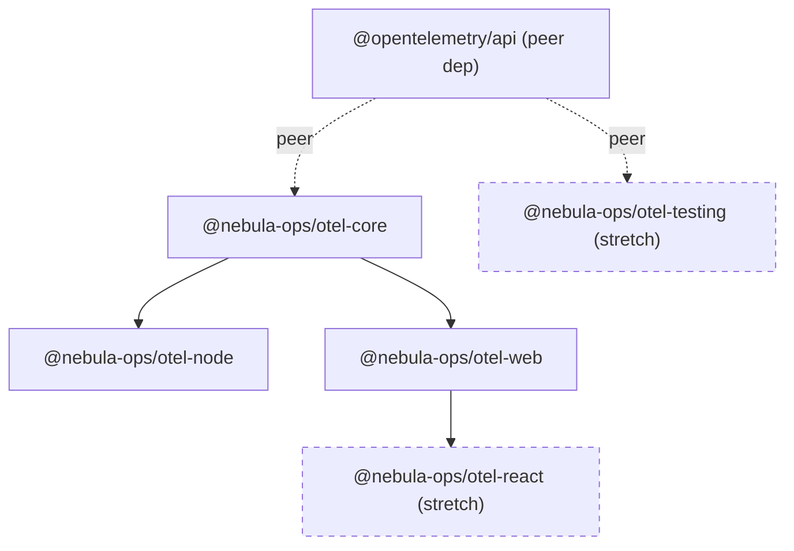

# Architecture — @nebula-ops/otel

## 1. Package dependency graph



Rules encoded in this graph (enforced by the dependency rule in the project brief,
and checked in CI — see [`docs/repo-scaffold.md`](repo-scaffold.md)):

- `otel-node` and `otel-web` each depend **only** on `otel-core` (and their respective
  Node/browser OTel SDK packages). They never depend on each other, directly or
  transitively.
- `otel-core` depends on **nothing environment-specific** — no Node builtins
  (`fs`, `http`, `async_hooks` is the one deliberate exception, see §4 below), no
  browser globals (`window`, `document`, `fetch`).
- `otel-react` depends on `otel-web` only (never on `otel-node`).
- `otel-testing` depends on `@opentelemetry/api` and `@opentelemetry/sdk-trace-base`
  in-memory exporters only — it is dependency-graph-neutral (usable alongside either
  `otel-node` or `otel-web` in a consuming app's test suite) and is not depended on by
  any other `@nebula-ops/*` package.

## 2. Public API surface per package

This is a signature-level surface — no implementation. Exact types are illustrative;
final types are frozen when each package spec is written (see
[`docs/package-specs/`](package-specs/)) and treated as the source of truth once
Phase 2 begins.

### `@nebula-ops/otel-core`

```ts
// Config
export interface NebulaOtelConfig {
  serviceName: string;
  serviceVersion?: string;
  environment?: string;
  endpoint?: string; // OTLP endpoint, defaults from env
  headers?: Record<string, string>;
  resourceAttributes?: Record<string, string | number | boolean>;
  sampling?: { ratio?: number };
}

export function resolveConfig(overrides?: Partial<NebulaOtelConfig>): NebulaOtelConfig;
export function buildResource(config: NebulaOtelConfig): Resource; // re-exports @opentelemetry/resources Resource

// Log-context correlation (environment-agnostic)
export interface LogContext {
  traceId?: string;
  spanId?: string;
  traceFlags?: number;
  attributes?: Record<string, unknown>;
}

export function getActiveLogContext(): LogContext;
export function runWithLogContext<T>(context: LogContext, fn: () => T): T;
export function bindLogContext<Args extends unknown[], R>(
  fn: (...args: Args) => R,
): (...args: Args) => R;

// Attribute / semantic-convention helpers
export const NebulaAttributes: {
  readonly SERVICE_NAME: 'service.name';
  readonly DEPLOYMENT_ENVIRONMENT: 'deployment.environment';
  // ...wraps @opentelemetry/semantic-conventions, adds nebula-ops-specific keys
};

// Config validation
export function validateConfig(config: unknown): NebulaOtelConfig; // throws NebulaConfigError
export class NebulaConfigError extends Error {}
```

### `@nebula-ops/otel-node`

```ts
export interface NebulaNodeSdkOptions extends Partial<NebulaOtelConfig> {
  instrumentations?: Instrumentation[]; // default: auto-instrumentations-node preset
  traceExporter?: SpanExporter; // default: OTLP over gRPC or HTTP per config
  metricReader?: MetricReader;
  logRecordProcessor?: LogRecordProcessor;
}

export function startNodeSdk(options?: NebulaNodeSdkOptions): NodeSDK;
export function shutdownNodeSdk(sdk: NodeSDK): Promise<void>;

// Logger bindings
export function createPinoMixin(): () => Record<string, unknown>; // pino `mixin` option
export function createWinstonFormat(): winston.Logform.Format;

// Convenience re-exports
export { trace, context, metrics } from '@opentelemetry/api';
```

### `@nebula-ops/otel-web`

```ts
export interface NebulaWebTracerOptions extends Partial<NebulaOtelConfig> {
  instrumentations?: Instrumentation[]; // default: fetch + XHR + document-load
  exporter?: SpanExporter; // default: OTLP/HTTP
  propagateTraceHeaderCorsUrls?: (string | RegExp)[];
}

export function initWebTracer(options?: NebulaWebTracerOptions): WebTracerProvider;
export function shutdownWebTracer(provider: WebTracerProvider): Promise<void>;

// web-vitals bridge
export function reportWebVitalsAsSpans(provider: WebTracerProvider): void;

// browser log/console binding
export function installConsoleBridge(options?: { levels?: ConsoleLevel[] }): () => void; // returns uninstall fn

export { trace, context } from '@opentelemetry/api';
```

### `@nebula-ops/otel-react` (stretch)

```ts
export function useSpan(name: string, options?: SpanOptions): Span;
export function withRouteChangeSpans(router: unknown, options?: RouteSpanOptions): void;
export class OtelErrorBoundary extends React.Component<OtelErrorBoundaryProps> {}
export function withOtelErrorBoundary<P>(Component: React.ComponentType<P>): React.ComponentType<P>;
```

### `@nebula-ops/otel-testing` (stretch)

```ts
export function createInMemorySpanExporter(): InMemorySpanExporter; // re-export/thin wrapper
export function createInMemoryLogExporter(): InMemoryLogRecordExporter;
export function expectSpan(spans: ReadableSpan[], matcher: SpanMatcher): void;
export function expectLogRecord(records: LogRecord[], matcher: LogRecordMatcher): void;
export function resetExporters(...exporters: { reset(): void }[]): void;
```

Full per-package detail (internal modules, exact dependency versions, non-goals) is
in [`docs/package-specs/`](package-specs/).

## 3. Config shape owned by `otel-core`

`otel-core` owns the single `NebulaOtelConfig` shape that both `otel-node` and
`otel-web` build on top of (each extending it with environment-specific options, never
redefining the shared fields). Resolution order (highest to lowest precedence):

1. Explicit overrides passed to `resolveConfig()` / `startNodeSdk()` / `initWebTracer()`.
2. Environment variables (Node: `process.env`; browser: build-time injected values,
   e.g. via bundler `define`, since browsers have no `process.env` at runtime).
3. Defaults.

| Config field         | Env var (Node)                | Notes                                                                                                                                                                                                                                                                                                                                                                          |
| -------------------- | ----------------------------- | ------------------------------------------------------------------------------------------------------------------------------------------------------------------------------------------------------------------------------------------------------------------------------------------------------------------------------------------------------------------------------ |
| `serviceName`        | `OTEL_SERVICE_NAME`           | Required; no default.                                                                                                                                                                                                                                                                                                                                                          |
| `serviceVersion`     | `NEBULA_OTEL_SERVICE_VERSION` | Falls back to consuming app's `package.json` version when available (Node only, best-effort).                                                                                                                                                                                                                                                                                  |
| `environment`        | `NEBULA_OTEL_ENVIRONMENT`     | e.g. `production`, `staging`, `local`. Maps to `deployment.environment` resource attribute.                                                                                                                                                                                                                                                                                    |
| `endpoint`           | `OTEL_EXPORTER_OTLP_ENDPOINT` | Standard OTel env var, honored directly. Assumes an OpenTelemetry Collector (or OTLP-compatible backend) is reachable at this address in production — this repo's code does not implement Collector-side concerns (tail sampling, durable buffering) itself; see [ADR 0002 #2](adr/0002-open-questions-resolutions.md#2-tail-based-sampling--collector-deployment-assumption). |
| `headers`            | `OTEL_EXPORTER_OTLP_HEADERS`  | Parsed from the standard `k1=v1,k2=v2` format. **Never a source of secrets committed to the repo** — always supplied by the consuming app's own env/secret manager.                                                                                                                                                                                                            |
| `resourceAttributes` | `OTEL_RESOURCE_ATTRIBUTES`    | Standard OTel env var (`k1=v1,k2=v2`), merged with `NebulaAttributes` and explicit overrides.                                                                                                                                                                                                                                                                                  |
| `sampling.ratio`     | `NEBULA_OTEL_SAMPLING_RATIO`  | 0–1, default `1.0` (100%) in every environment — deliberately not pre-guessed lower for production since this is a new project with no traffic baseline to size a default against; each service overrides once its volume is known. See [ADR 0002 #2](adr/0002-open-questions-resolutions.md#2-tail-based-sampling--collector-deployment-assumption).                          |

`otel-node` reads Node env vars directly. `otel-web` never reads `process.env` at
runtime — browser config values must be explicitly passed in (typically injected at
build time by the consuming app's bundler). This keeps `otel-core`'s `resolveConfig`
itself environment-agnostic: it accepts a plain object of overrides/env-derived values
rather than reaching into `process.env` itself, and each of `otel-node`/`otel-web`
is responsible for gathering that object from its own environment before calling in.

## 4. `otel-core` environment-agnostic constraint

`otel-core` must have zero Node-only or browser-only imports. The one nuance is
log-context propagation: it uses the standard OTel `context` API (`@opentelemetry/api`)
for span/trace correlation, which is environment-agnostic by design (it's just an
interface over a pluggable `ContextManager`). `otel-core` does **not** import
`async_hooks` directly — `otel-node` is responsible for installing
`AsyncLocalStorageContextManager` (Node-only) and `otel-web` for installing the
zone/stack-based context manager appropriate for browsers, both against the same
`otel-core` `LogContext` helpers. This is what "AsyncLocalStorage + OTel context API"
in the brief means in practice: the _API_ (`otel-core`) is environment-agnostic; the
_ContextManager implementation_ is supplied by the environment-specific package.

Verification approach (detailed in [`docs/repo-scaffold.md`](repo-scaffold.md) CI
outline):

- `otel-core`'s `package.json` `exports` field has no `browser` or `node`-conditional
  entries — a single entry point, proving it doesn't need environment branching.
- A lint rule / dependency-check script (e.g. `depcheck` + a custom ESLint
  `no-restricted-imports` rule) blocks Node builtins (`fs`, `http`, `net`,
  `async_hooks`, etc.) and browser globals from being imported in `packages/otel-core/src`.
- A bundler smoke-test (esbuild with `platform: 'browser'` and no polyfills) builds
  `otel-core` cleanly as part of CI, catching accidental Node-only imports that
  TypeScript alone wouldn't.

## 5. OTel SDK peer-dependency strategy

**`@opentelemetry/api` is a peer dependency** (with a matching `devDependency` for
local build/test) in every `@nebula-ops/*` package that touches OTel types (`otel-core`,
`otel-node`, `otel-web`, `otel-react`, `otel-testing`). Rationale:

- `@opentelemetry/api` uses a global registration pattern (`trace.setGlobalTracerProvider`,
  etc.). If `otel-core` and `otel-node` each bundled or depended on _their own_ copy of
  `@opentelemetry/api`, a consuming app could end up with two API instances that don't
  share global state — spans created via one wouldn't be visible to the other. Peer-depending
  forces a single shared instance resolved from the consuming app's `node_modules`.
- It's the pattern the upstream OpenTelemetry JS packages themselves use for exactly
  this reason.

**Version-pinning approach:**

- `@opentelemetry/api`: peer dependency range `^1.9.0` (wide, semver-minor-compatible
  range) across all packages — the API package is deliberately kept stable/slow-moving
  upstream, so a wide range minimizes consumer friction.
- `@opentelemetry/sdk-trace-node`, `@opentelemetry/sdk-trace-web`,
  `@opentelemetry/sdk-metrics`, `@opentelemetry/sdk-logs`,
  `@opentelemetry/exporter-trace-otlp-http` (and other exporters), and
  `@opentelemetry/auto-instrumentations-node`: **regular (non-peer) `dependencies`**,
  pinned to an exact or tilde (`~`) range within each package, because these are
  implementation details `otel-node`/`otel-web` own internally — consumers don't need
  to (and shouldn't) provide their own copies, and mismatched SDK-package versions
  across the OTel JS SDK are a known source of runtime breakage upstream. Exact
  versions are recorded per-package in [`docs/package-specs/`](package-specs/) and bumped
  deliberately (via a changeset) rather than left on loose ranges.
- `@opentelemetry/semantic-conventions`: regular `dependency` on `otel-core`
  (re-exported, not peer — it's just constants, no global-state concerns).

This mirrors the strategy upstream OpenTelemetry JS itself uses: `@opentelemetry/api`
peer + wide range, SDK/exporter/instrumentation packages as regular pinned
dependencies internal to the package that uses them.
